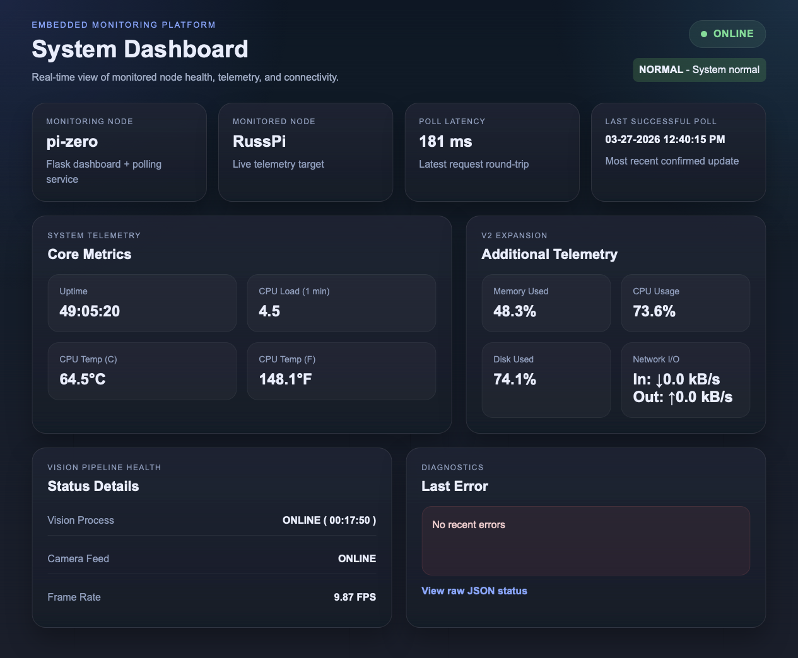
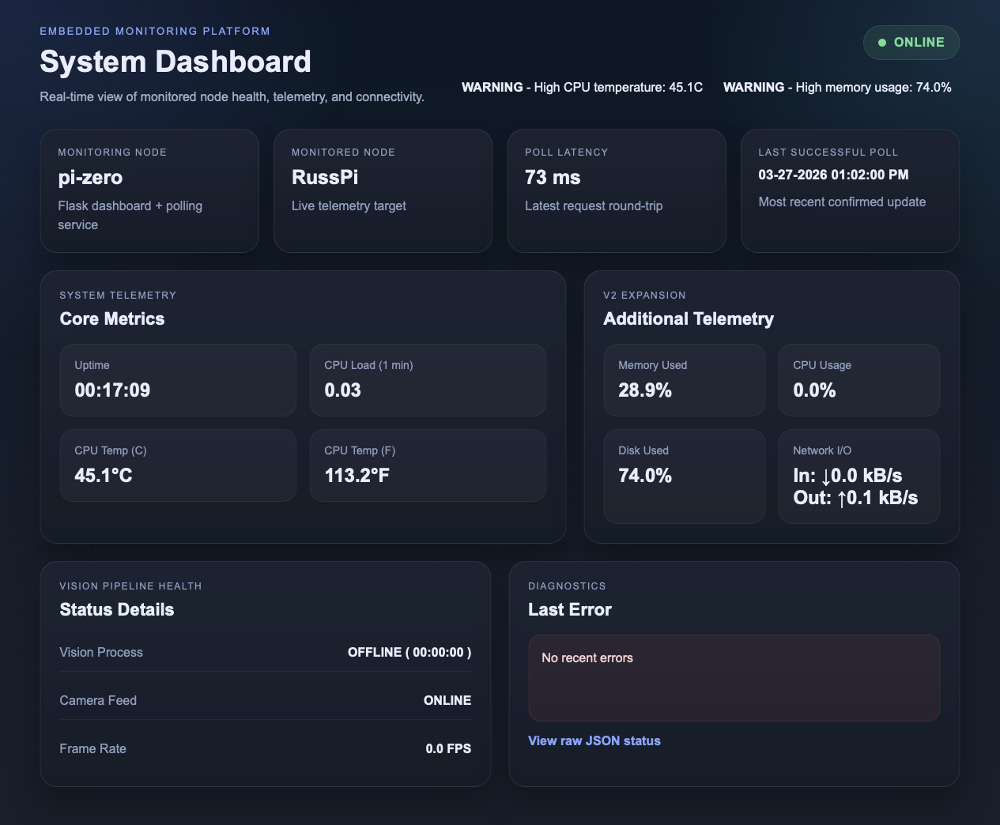
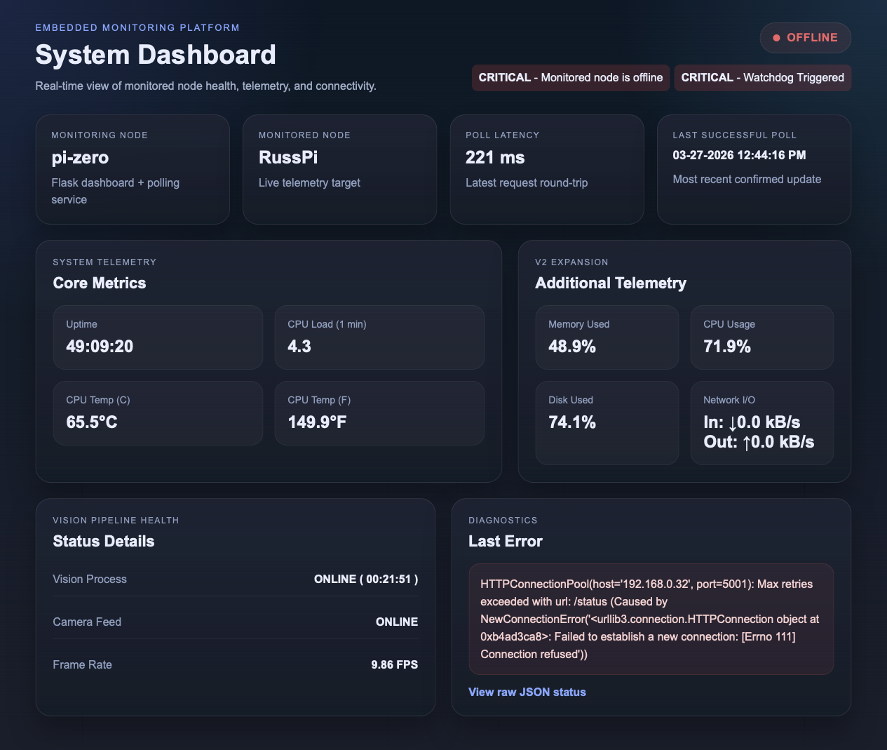
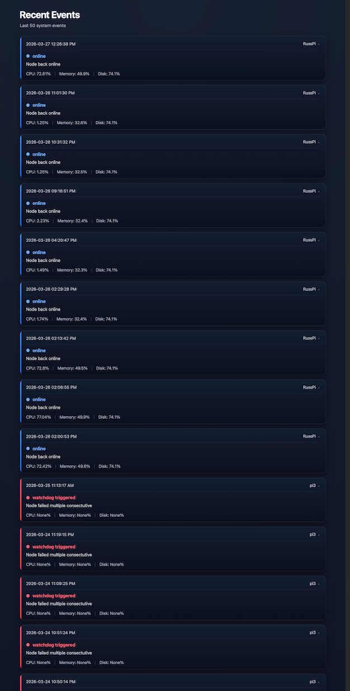

# Embedded Monitoring Platform (Raspberry Pi)

Lightweight distributed monitoring system built using Raspberry Pi devices featuring real-time telemetry collection, network polling, and a live monitoring dashboard.

The system implements a simple monitoring architecture where one embedded device exposes system telemetry through an HTTP API while another device periodically polls that endpoint and presents the data through a web dashboard.

This project demonstrates how a basic monitoring system can be implemented on resource-constrained embedded hardware using lightweight networking and web technologies.

## Features

- Distributed monitoring between two embedded devices
- Real-time telemetry collection from a monitored node
- Lightweight HTTP telemetry API
- Background polling thread on the monitoring node
- Online/offline node detection
- Poll latency measurement
- Live monitoring dashboard with automatic refresh
- CPU temperature monitoring
- System uptime tracking
- Memory usage monitoring
- Disk usage monitoring
- CPU usage percentage (calculated from kernel stats)
- Network I/O monitoring (kB/s)
- Vision pipeline health monitoring (process, camera, FPS, runtime)
- Local timezone display for telemetry timestamps
- Preservation of last known telemetry when a node goes offline
- Watchdog-style failure detection
- Event logging system with metric snapshots
- Dedicated logging dashboard for recent system events
- Alert system for latency, resource usage, and staleness
- Raw JSON monitoring endpoint for debugging
- Designed for embedded hardware constraints

## System Architecture

```text
Monitored Node (Raspberry Pi 3B+)
Telemetry Server (Flask)
  │
  │ JSON telemetry + vision metrics
  ▼
Monitoring Node (Raspberry Pi Zero W)

Polling Thread
  → Fetch telemetry
  → Measure latency
  → Detect failures / watchdog
  → Update shared monitoring state

Dashboard Server (Flask)
  → Render dashboard
  → Serve logging view
  → Expose monitoring API

  │
  ▼
Browser
Dashboard + Logs
```

The monitoring node polls the monitored node over the local network and updates the dashboard with the latest telemetry data.

This architecture separates telemetry collection from monitoring presentation, allowing lightweight embedded devices to monitor other systems without requiring heavy infrastructure.

## Dashboard

Live monitoring dashboard displaying telemetry, node status, alerts, and system health in real time.

### Normal Operation



### Warnings Active


### Offline Operation


The dashboard reflects real-time system state, including resource thresholds, connectivity issues, and watchdog-triggered failures.


### Event Logging
Recent system events are captured and displayed in a dedicated logging dashboard.



Events include state transitions (online/offline), failures, and watchdog triggers, along with a snapshot of system metrics at the time of the event.

## Monitoring Pipeline

```text
Monitoring Node
↓
Send HTTP GET /status
↓
Monitored Node
↓
Collect system telemetry
↓
Return JSON response
↓
Monitoring Node
↓
Update monitoring state
↓
Evaluate alerts / log events
↓
Render dashboard
```

The system operates through a simple telemetry polling loop.

Telemetry collection and dashboard rendering are separated to keep the dashboard responsive while the monitoring logic runs in a background polling thread.

## Node Responsibilities

### Monitoring Node

Device: Raspberry Pi Zero W

Responsibilities:

- Poll the monitored node every 5 seconds
- Measure request latency
- Track node online/offline status
- Store latest telemetry response in memory
- Convert UTC timestamps to local display time
- Host the monitoring dashboard
- Provide a raw monitoring API endpoint

### Monitored Node

Device: Raspberry Pi 3B+

Responsibilities:

- Collect system telemetry
- Expose telemetry through a lightweight Flask API
- Provide system health metrics through the /status endpoint

## Telemetry Data

The monitored node exposes the following metrics:

- hostname
- uptime (seconds)
- CPU load average (1 minute)
- CPU temperature (°C)
- CPU usage (%)
- memory usage (%)
- disk usage (%)
- network I/O (kB/s)
- timestamp (UTC)

Additionally, vision pipeline health metrics are exposed:

- vision process running
- camera status
- FPS
- vision runtime (seconds)

Example response:

```json
{
  "hostname": "RussPi",
  "timestamp": "2026-03-16T21:05:12Z",
  "uptime_seconds": 14852,
  "cpu_load_1min": 0.32,
  "cpu_temp_c": 49.8,
  "cpu_usage_percent": 27.4,
  "memory_usage_percent": 61.2,
  "disk_usage_percent": 54.8,
  "network_io_kbps": {
    "rx": 8.7,
    "tx": 12.5
  },
  "vision_process_running": true,
  "camera_online": true,
  "fps": 6.2,
  "vision_runtime_seconds": 932
}
```

## Version Progression

### Version 1 — Distributed Monitoring Prototype

Files:

```text
monitor-node/server_v1.py
monitored-node/status_server_v1.py
```

Capabilities:

- Distributed monitoring between two Raspberry Pi devices
- Lightweight telemetry API
- Periodic polling of monitored node
- Poll latency measurement
- Online/offline node detection
- Live monitoring dashboard
- Automatic dashboard refresh

Goal: implement a simple embedded monitoring system capable of collecting and displaying telemetry from another device over a local network.

### Version 2 — Monitoring Expansion


Capabilities:

- Expanded telemetry (memory, disk, CPU usage, network I/O)
- Vision pipeline monitoring via shared status file
- Alert system for latency, resource thresholds, and stale data
- Watchdog-style detection of repeated polling failures
- Event logging system with metric snapshots
- Dedicated logging dashboard for recent events
- Reworked dashboard layout and improved visual clarity
- Cleaner separation between monitoring logic and presentation

Goal: extend the monitoring system beyond basic telemetry into a more complete observability platform with alerting, logging, and improved system visibility.

## Repository Structure

```text
embedded-monitoring-platform
│
├── monitor-node
│   ├── server_v1.py
│   ├── server_v2.py
│   ├── templates
│   │   ├── dashboard.html
│   │   └── logging.html
│   └── static
│       └── style.css
│
├── monitored-node
│   ├── status_server_v1.py
│   └── status_server_v2.py
│
├── screenshots
│   ├── dashboard_normal.png
│   ├── dashboard_warning.png
│   ├── dashboard_offline.png
│   └── logging_view.png
│
├── requirements.txt
├── README.md
└── .gitignore
```

## Tech Stack

- Python
- Flask
- Requests
- Raspberry Pi
- Linux system utilities

## Hardware

Monitoring Node
- Raspberry Pi Zero W

Monitored Node
- Raspberry Pi 3B+

## Installation

Clone the repository:

```bash
git clone https://github.com/russellsoto/embedded-monitoring-platform.git
cd embedded-monitoring-platform
```

## Running the System

### Monitored Node

Navigate to the monitored node directory:

```bash
cd monitored-node
```

Install dependencies:

```bash
pip install -r requirements.txt
```

Run the telemetry server:

```bash
python status_server_v2.py
```

The telemetry endpoint will be available at:

```text
http://<pi3-ip>:5000/status
```

## Monitoring Node

Navigate to the monitoring node directory:

```bash
cd monitor-node
```

Install dependencies:

```bash
pip install -r requirements.txt
```

Run the monitoring dashboard:

```bash
python server_v2.py
```

Access the dashboard at:

```text
http://<pi-zero-ip>:5000
```

## Engineering Focus

This project focuses on building a practical distributed monitoring system while emphasizing:

- Embedded system networking
- Lightweight telemetry APIs
- Distributed architecture across edge devices
- Real-time monitoring dashboards
- Efficient resource usage on embedded hardware

The goal is to demonstrate how simple tools such as Python and Flask can be used to build functional distributed systems on small embedded devices.

## Potential Applications

- Embedded device monitoring
- IoT device health monitoring
- Edge device management
- Distributed robotics systems
- Home lab infrastructure monitoring

## License

MIT License

Built by Russell Soto  
See you, space cowboy
